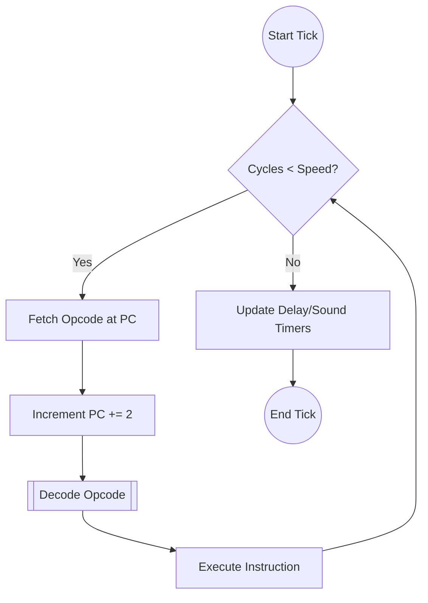
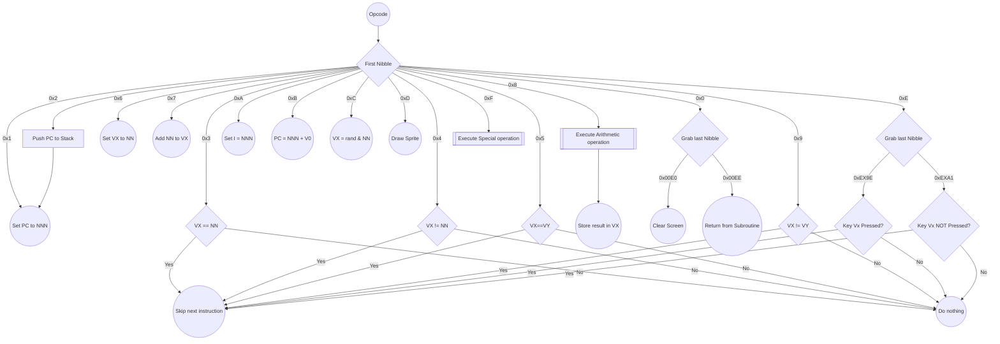
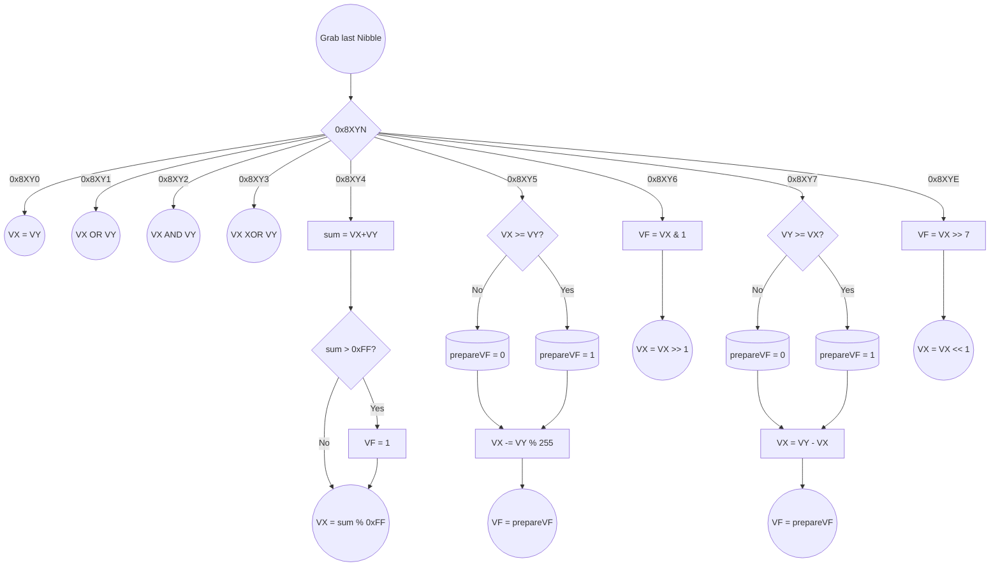
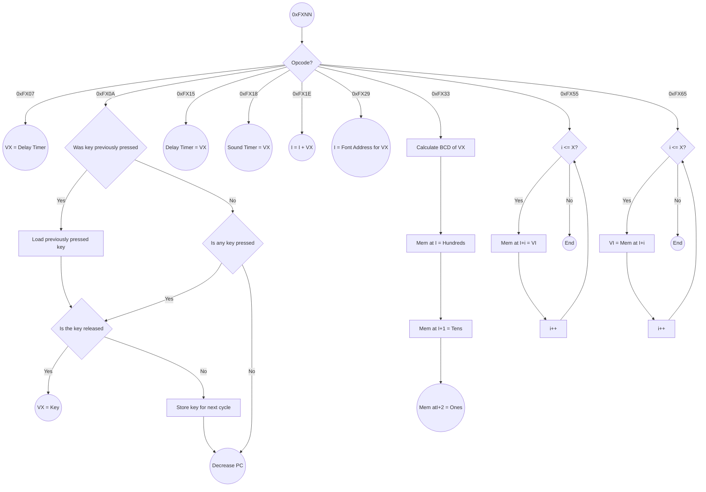
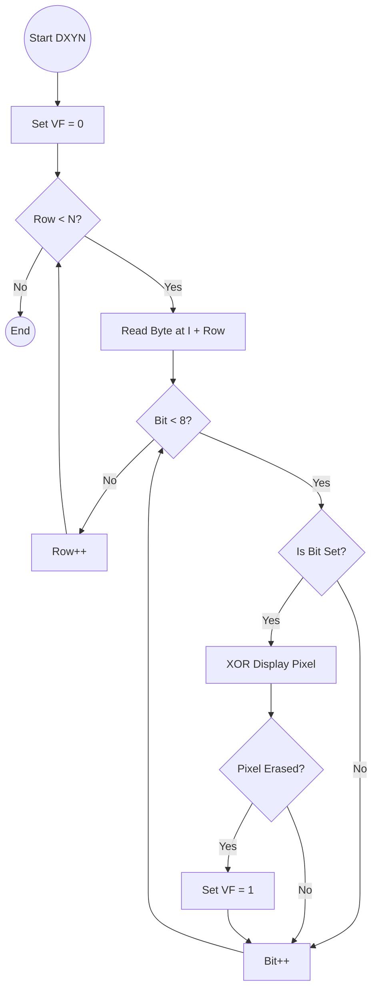

# Emulator Core Documentation

The core emulation logic is decoupled from the frontend, allowing it to be used in both the Qt desktop application and the Python AI module.

## Components

*   [SuperChip8](SuperChip8.cpp) - The main CPU / Facade class.
*   [Memory](Memory.md) - RAM management and font loading.
*   [Registers](Registers.md) - CPU registers (V, I, PC, SP) and timers.
*   [Display](Display.md) - 64x32 pixel buffer and drawing logic.
*   [Keyboard](Keyboard.md) - 16-key hex keypad state.

## Architecture

The `SuperChip8` class acts as the central controller. It owns instances of Memory, Registers, Display, and Keyboard. It executes the fetch-decode-execute cycle via the `Tick()` method.

## Flowcharts

### CPU Cycle (Tick)

### Jumptable Logic

This emulator uses precompiled jump tables, Decoding is split into smaller chunks, and is directed by table of function pointers
to the proper instruction. This graph takes place between decode and execute from chart above.

#### Arithmetic operations 0x8XYN

#### Special Operations 0xFXNN

### Drawing Logic (DXYN)

