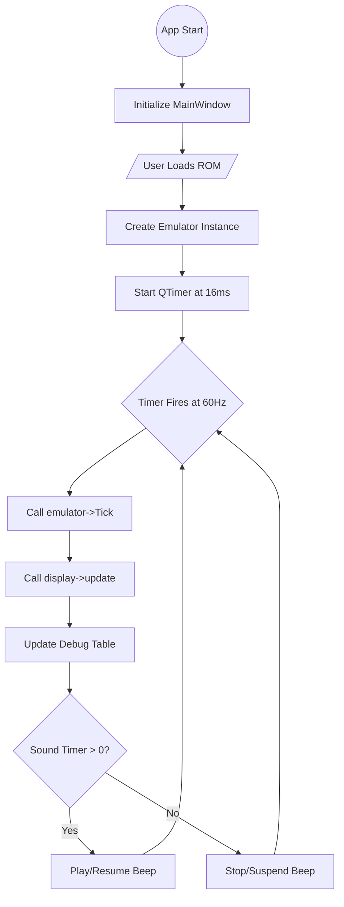

# Qt GUI Documentation

The Desktop Application provides a graphical interface for the emulator using the Qt 6 framework.

## Components

*   **MainWindow**: The main application window, handling the menu bar, toolbar, and emulation loop.
*   **EmulatorDisplay**: A custom `QOpenGLWidget` that renders the emulator's display buffer.
*   **SettingsDialog**: A dialog for configuring emulator settings (colors, grid, quirks).

## Flowcharts

### Main Loop

